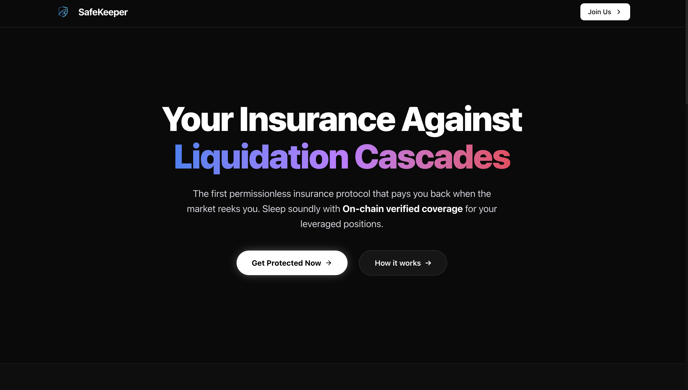
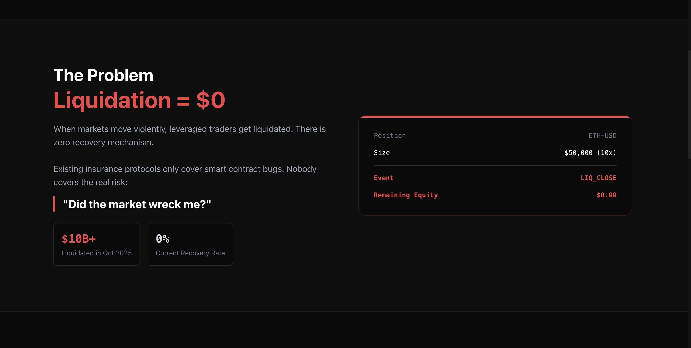
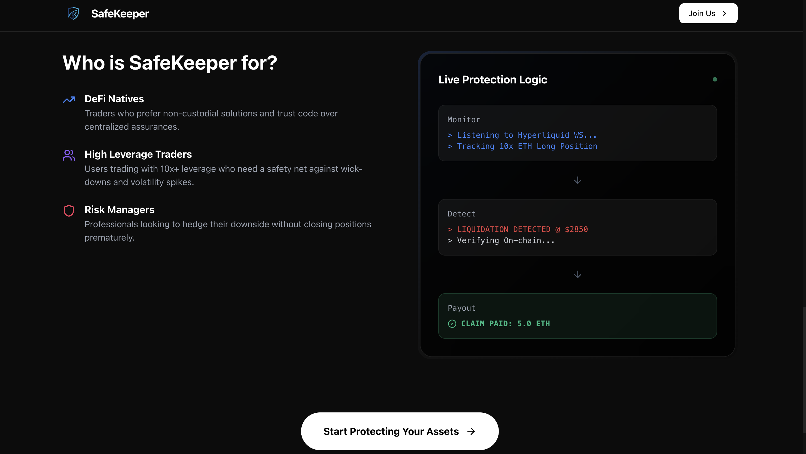
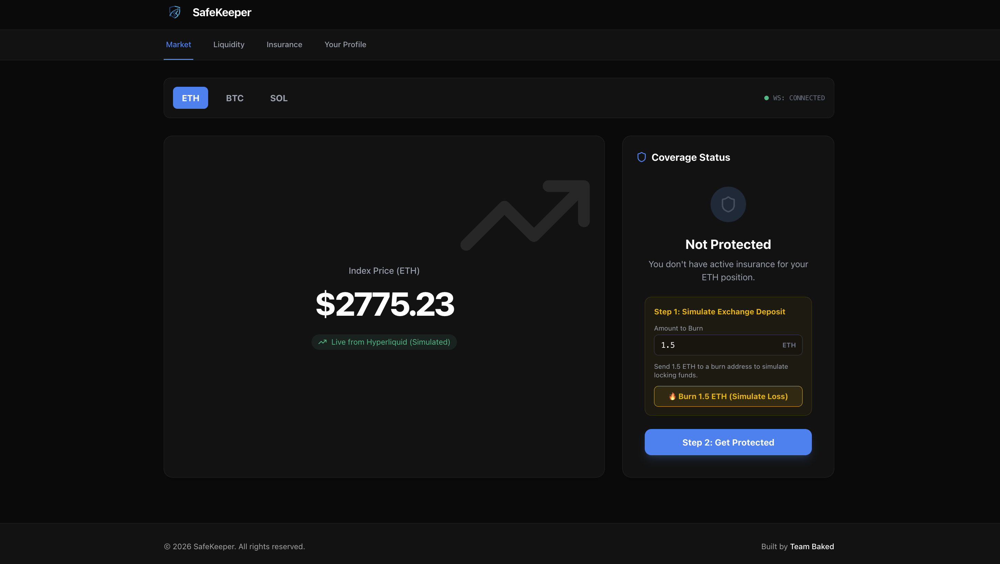
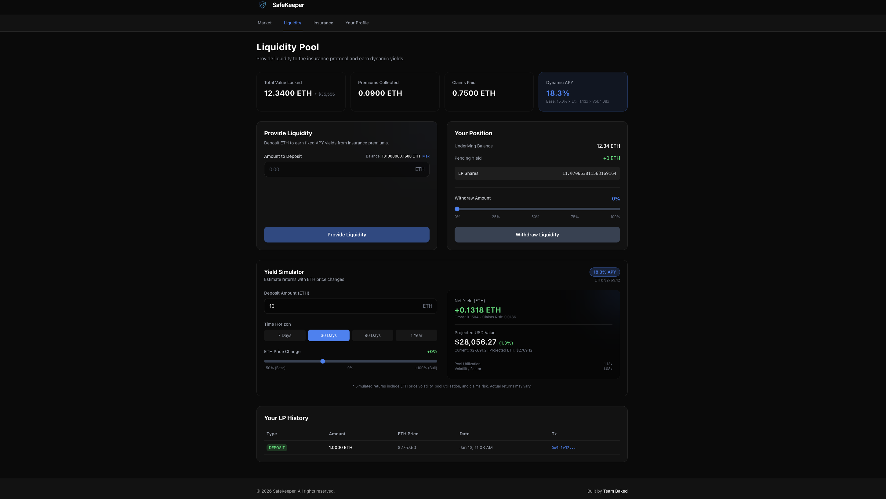
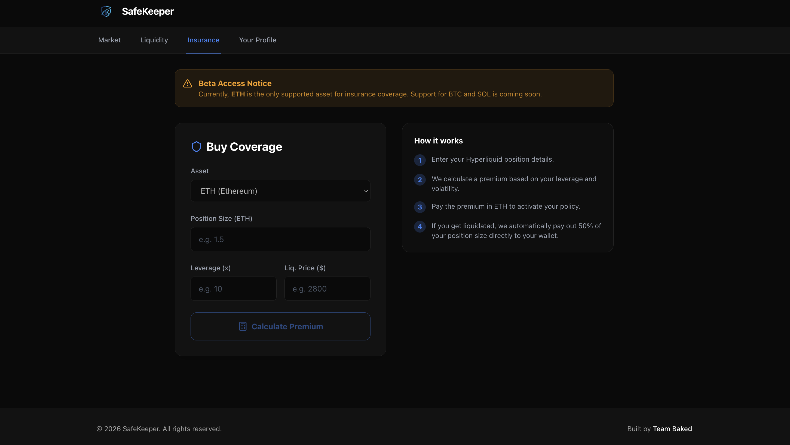
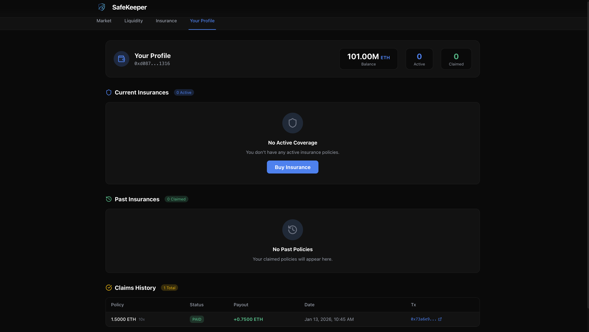
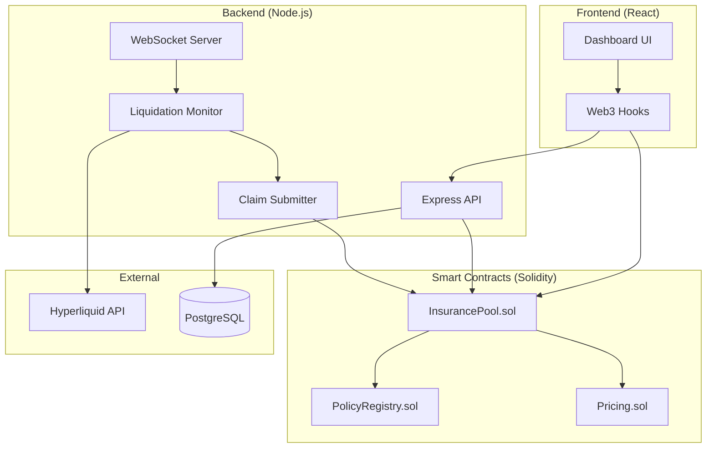

# SafeKeeper

**Permissionless liquidation insurance protocol for decentralized perpetual traders.**

---

## What is SafeKeeper

SafeKeeper is an on-chain insurance protocol that protects leveraged traders from liquidation losses. Unlike traditional insurance protocols that cover smart contract risks (hacks, exploits), SafeKeeper covers market risk - when volatile price movements force-close your position.

Traders pay a small premium to insure their positions. If liquidated, the smart contract automatically pays back a percentage of the loss. No claims to file, no waiting period - instant, trustless payouts verified on-chain.

### How It Works

1. **Connect Wallet** - Connect your wallet to the SafeKeeper dApp
2. **Buy Insurance** - Select your position size, leverage, and pay the calculated premium
3. **Trade Normally** - Open your leveraged position on Hyperliquid
4. **Get Protected** - If liquidated, SafeKeeper automatically detects and pays out 50% of your loss
5. **Claim Received** - Funds are sent directly to your wallet, no manual claims needed

---

## Screenshots

### Landing Page

| | | |
|:--:|:--:|:--:|
|  |  |  |
| Hero Section | Features Section | Call to Action |

### Dashboard

| | |
|:--:|:--:|
|  |  |
| Market Tab | Liquidity Tab |
|  |  |
| Insurance Tab | Profile Tab |

---

## Why SafeKeeper

### The Problem

October 2025: Over $10 billion liquidated on Hyperliquid in a single cascade event. Traders using high leverage watched their accounts go to zero in seconds with no recovery mechanism.

Existing insurance protocols (Nexus Mutual, InsurAce) only cover smart contract failures. Nobody covers the liquidation risk from market volatility.

### The Gap in the Market

| Insurance Type | What It Covers | Examples |
|----------------|----------------|----------|
| Smart Contract Insurance | Hacks, exploits, bugs | Nexus Mutual, InsurAce |
| **Liquidation Insurance** | Market volatility, forced closures | **SafeKeeper** |

These are fundamentally different problems - like how car insurance and health insurance are both "insurance" but solve different problems.

### Who Is It For

- **Leveraged Traders**: Protect your perpetual positions from sudden price drops
- **Liquidity Providers**: Earn yield by providing capital to the insurance pool
- **DeFi Protocols**: Integrate SafeKeeper to offer insurance as a feature

### Reference: October 2025 Cascade

This is not a theoretical problem. The October liquidation cascade on Hyperliquid proved the demand - traders lost everything with no protection available. SafeKeeper exists because of this event.

---

## Architecture



### Data Flow

**Insurance Purchase:**
1. User selects position size and leverage on the frontend
2. Frontend queries Pricing contract to calculate premium
3. User signs transaction and pays premium in ETH
4. InsurancePool receives payment and creates policy via PolicyRegistry
5. Policy is stored on-chain with position details and coverage terms

**Liquidation Detection:**
1. Backend runs a liquidation monitor job every few seconds
2. Monitor fetches current market prices from Hyperliquid API
3. Compares prices against insured positions' liquidation thresholds
4. When a position is liquidated, backend detects via position state check
5. Claim submitter is triggered automatically

**Claim Payout:**
1. Claim submitter calls InsurancePool.submitClaim() with policy details
2. InsurancePool verifies policy exists and is active via PolicyRegistry
3. Calculates payout amount (50% of position size by default)
4. Transfers ETH directly to trader's wallet
5. Marks policy as claimed in PolicyRegistry

---

## Key Files

### InsurancePool.sol

The core contract managing the insurance pool. This is the main entry point for all insurance operations.

**Responsibilities:**
- Premium collection and policy creation
- Claim processing and payouts
- LP deposits and withdrawals with yield accrual
- Pool administration (pause, emergency withdraw)

**Key Functions:**

| Function | Description |
|----------|-------------|
| `buyInsurance()` | Purchase a policy by paying premium |
| `submitClaim()` | Admin triggers payout for liquidated position |
| `deposit()` | LP deposits ETH and receives shares |
| `withdraw()` | LP redeems shares for ETH + interest |
| `getPoolStatus()` | Returns pool balance, premiums, claims stats |

### PolicyRegistry.sol

Manages the lifecycle of insurance policies. Supports multiple policies per user.

**Key Functions:**

| Function | Description |
|----------|-------------|
| `createPolicy()` | Create new policy with position details |
| `markClaimed()` | Mark policy as claimed after payout |
| `getActivePolicies()` | Get all unclaimed policies for a user |
| `hasPolicy()` | Check if user has any active policy |

### hyperliquidService.js

Backend service for monitoring Hyperliquid positions. The brain of liquidation detection.

**Features:**
- Real-time position monitoring via Hyperliquid API
- Mock mode for demo/testing with simulated price movements
- Liquidation detection comparing current price vs liquidation price
- Account state, order, and fill fetching
- Supports both live Hyperliquid API and local mock mode

---

## Shardeum Deployed Addresses

| Contract | Address | Status |
|----------|---------|--------|
| Pricing | `0x07b09b71F9274d18D5dAe624E4021b23090D040A` | Deployed |
| InsurancePool | - | Pending (insufficient testnet tokens) |
| PolicyRegistry | - | Pending (insufficient testnet tokens) |

Note: InsurancePool and PolicyRegistry deployment pending due to lack of Shardeum testnet tokens. PolicyRegistry is deployed automatically when InsurancePool is deployed.

---

## File Structure

```
safe-keeper/
├── backend/
│   ├── src/
│   │   ├── config/         # Viem client, contract ABIs
│   │   ├── jobs/           # Liquidation monitor cron
│   │   ├── routes/         # API endpoints (insurance, claims, pool, auth)
│   │   ├── services/       # Hyperliquid service, claim submitter
│   │   ├── websocket/      # Real-time WebSocket server
│   │   └── index.js        # Express server entry point
│   ├── prisma/             # Database schema and migrations
│   └── tests/              # Backend tests
│
├── frontend/
│   ├── src/
│   │   ├── components/     # React UI components (dashboard, shared, layout)
│   │   ├── hooks/          # Web3 hooks (useInsurance, useLiquidity, usePool)
│   │   ├── pages/          # Page components (Landing, Dashboard)
│   │   └── services/       # API client services
│   ├── public/             # Static assets and images
│   └── index.html          # Entry HTML
│
├── web3/
│   ├── contracts/          # Solidity smart contracts
│   │   ├── InsurancePool.sol   # Core insurance pool logic
│   │   ├── PolicyRegistry.sol  # Policy management
│   │   └── Pricing.sol         # Premium calculation
│   ├── scripts/            # Deployment and utility scripts
│   └── test/               # Contract unit tests
│
├── scripts/                # Project-level scripts
└── README.md
```

---

## Tech Stack

### Frontend
- **React 18** with Vite for fast development
- **Wagmi v2** + **Viem** for Web3 wallet connections and contract interactions
- **TailwindCSS** for styling
- **React Router** for navigation

### Backend
- **Node.js** with **Express.js** for REST API
- **Prisma ORM** with **PostgreSQL** for data persistence
- **WebSocket** for real-time price and policy updates
- **Viem** for blockchain interactions

### Smart Contracts
- **Solidity 0.8.20** for contract development
- **Hardhat** for compilation, testing, and deployment
- **OpenZeppelin** patterns for security best practices

### Infrastructure
- PostgreSQL database for policy and user data
- WebSocket server for real-time frontend updates
- Hardhat local node for development testing

### Future: ZK Verification

We are in the process of implementing ZK (Zero-Knowledge) proofs for making the backend verifiable. This will enable trustless liquidation verification without relying on a centralized backend oracle. The goal is to generate ZK proofs of Hyperliquid liquidation events that can be verified on-chain before payouts.

---

## Getting Started

### Prerequisites
- Node.js 18+
- PostgreSQL
- MetaMask or compatible Web3 wallet

### Installation

```bash
# Clone the repository
git clone https://github.com/team-baked/safe-keeper.git
cd safe-keeper

# Install dependencies
cd backend && npm install
cd ../frontend && npm install
cd ../web3 && npm install

# Set up environment variables
cp backend/.env.example backend/.env
cp frontend/.env.example frontend/.env
cp web3/.env.example web3/.env

# Run database migrations
cd backend && npx prisma migrate dev

# Start local blockchain
cd web3 && npx hardhat node

# Deploy contracts (in another terminal)
cd web3 && npx hardhat run scripts/deploy.js --network localhost

# Start backend server
cd backend && npm run dev

# Start frontend
cd frontend && npm run dev
```

---

## Business Pitch

[View Full Pitch Deck on Canva](https://www.canva.com/design/DAG-Qb2EUWE/zJ06pKnbBwdbzuuWDJ8Nzw/edit?utm_content=DAG-Qb2EUWE&utm_campaign=designshare&utm_medium=link2&utm_source=sharebutton)

---

## License

MIT License

---

Built by Team Baked.
