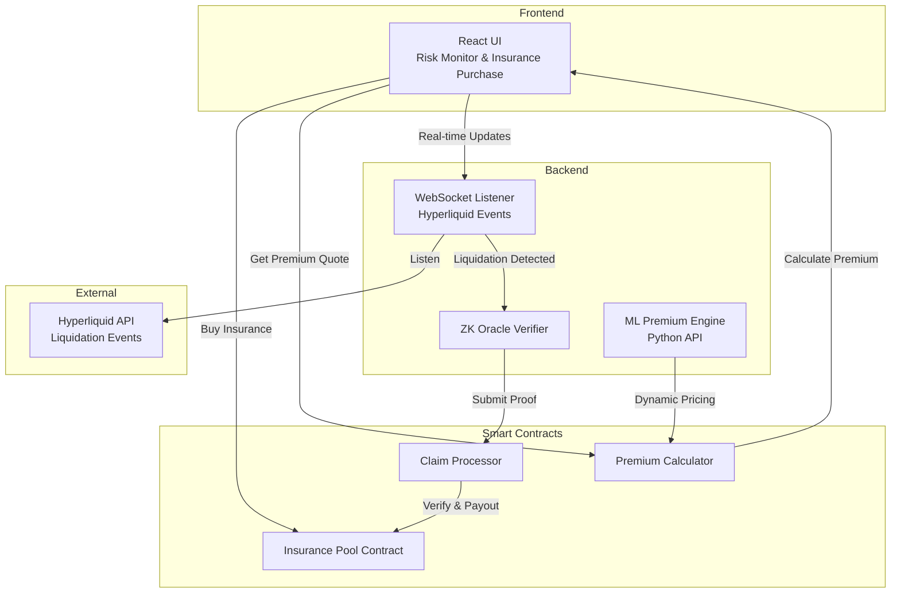

# SafeKeeper

**Trust-less liquidation insurance protocol on Hyperliquid using ZK proofs and machine learning for dynamic premium pricing**

---

## The Problem

**October 2025: Over $10 billion liquidated on Hyperliquid in a single cascade event.**

When markets move violently, leveraged traders get liquidated—their positions are forcibly closed, and they lose everything. There's zero recovery mechanism. You watch your account go to $0 in seconds.

### The Current Gap

- **Existing insurance protocols** (Nexus Mutual, InsurAce) only cover **smart contract failures**—bugs, hacks, exploits
- **Nobody covers liquidation risk**—the market moving against your position
- These are fundamentally different problems:
  - Smart contract risk = "Did the code break?"
  - Liquidation risk = "Did the market wreck me?"

**Traders using high leverage on decentralized perpetuals have zero protection against liquidation.**

---

## Our Solution

**SafeKeeper** is a permissionless insurance protocol that protects traders from liquidation losses.

### How It Works

1. **Buy Insurance**: Traders pay a small dynamic premium (0.5-3% of position size) to insure their leveraged positions
2. **Get Liquidated**: Market moves against you, and your position gets liquidated on Hyperliquid
3. **Instant Payout**: Smart contract automatically pays you 50-80% of your loss back—verified cryptographically via ZK proofs
4. **No Trust Required**: Liquidations are verified on-chain using zero-knowledge proofs, not by a centralized backend

### Example

- You have a $50,000 position with 10x leverage on Hyperliquid
- You pay a $500 insurance premium (1% of position size)
- Market crashes. You get liquidated and lose $50,000
- **SafeKeeper instantly pays you $30,000 back** (60% coverage)
- **Net loss: $20,500** instead of $50,000

---

## Core Features

### 1. Smart Contract Insurance Pool
- Permissionless liquidity pools where anyone can become an LP and earn yield from insurance premiums
- Instant, atomic claim payouts when liquidations are verified on-chain
- Self-correcting economics: Pool automatically adjusts premiums up when capital is low, down when abundant

### 2. ZK Oracle Integration
- **Trustless liquidation verification** without backend intermediaries
- Smart contract verifies zero-knowledge proofs cryptographically before paying claims
- No centralized party can lie about whether a liquidation occurred—it's mathematically proven on-chain

### 3. Dynamic Premium Calculator
- Machine learning model trained on October 2025 liquidation data
- Premiums adapt to real-time market conditions:
  - High volatility → Higher premiums
  - High leverage → Higher premiums
  - Stressed insurance pool → Higher premiums
  - Healthy account → Lower premiums
- Captures non-linear relationships that static formulas miss

### 4. Real-Time Liquidation Listener
- WebSocket integration with Hyperliquid API for sub-second liquidation detection
- Automatic claim triggering when an insured account gets liquidated
- No manual claim filing—everything happens automatically

### 5. Live Liquidation Risk Simulator
- Real-time health factor tracking shows traders exactly how close they are to liquidation
- Second-by-second updates based on current positions and market prices
- Payout preview: "If you're liquidated RIGHT NOW, SafeKeeper pays you $X back"

---

## Architecture (Tentative Architecture - Not Finalized)

### Data Flow

**Insurance Purchase:**
- Trader inputs position details (size, leverage, asset)
- ML engine calculates premium based on volatility and pool stress
- Smart contract locks premium in insurance pool

**Liquidation Detection:**
- WebSocket listener monitors Hyperliquid for liquidation events
- When insured account liquidates, backend generates ZK proof
- Proof submitted to smart contract

**Claim Payout:**
- Smart contract verifies ZK proof cryptographically
- If valid, automatic payout to trader (50-80% of loss)
- Pool balance updates, premium recalculation triggered

---

## Tech Stack

### Frontend
- React with TypeScript
- Ethers.js / Wagmi for Web3 interactions
- Tailwind CSS for styling
- WebSocket client for real-time updates

### Backend
- Node.js with Express and TypeScript
- WebSocket server for Hyperliquid integration
- Redis for caching liquidation events and pool state
- PostgreSQL for historical data and analytics

### Smart Contracts
- Solidity for all on-chain logic
- Hardhat for development and testing
- Chainlink oracles for price feeds
- ZK Oracle integration for trustless liquidation verification

### Machine Learning
- Python with FastAPI for ML model serving
- Trained on October 2025 liquidation cascade data
- Features: volatility, leverage, health factor, pool utilization
- Fallback to rule-based pricing if ML fails

---

## Why SafeKeeper is Unique

### 1. First Liquidation Insurance on Hyperliquid
Existing solutions (Nexus Mutual, InsurAce) cover smart contract risk (hacks, exploits). SafeKeeper covers **market risk** (liquidations from volatility). These are fundamentally different categories—like how car insurance and health insurance are both "insurance" but solve different problems.

### 2. Trustless with ZK Verification
Liquidations are verified cryptographically on-chain using zero-knowledge proofs. No centralized backend can lie about liquidation events. The smart contract verifies the proof mathematically before paying out.

### 3. Dynamic ML-Based Pricing
Static formulas can't capture the chaos of crypto markets. Our ML model learned from October 2025's $10B liquidation cascade and adapts premiums in real-time based on market volatility, position leverage, account health factor, and insurance pool stress.

### 4. Self-Correcting Economics
The insurance pool automatically adjusts premiums without manual governance. Pool draining means premiums increase and more LPs are attracted. Pool overfunded means premiums decrease and more traders buy insurance. Elegant algorithmic incentives, no human intervention needed.

### 5. Proof of Demand: October 2025
This isn't a theoretical problem. Two months ago, $10B+ was liquidated on Hyperliquid in a single cascade. Traders lost everything. SafeKeeper solves a problem **everyone just experienced**.

---

## License

MIT License - see LICENSE file for details

---

Built by Team Baked

